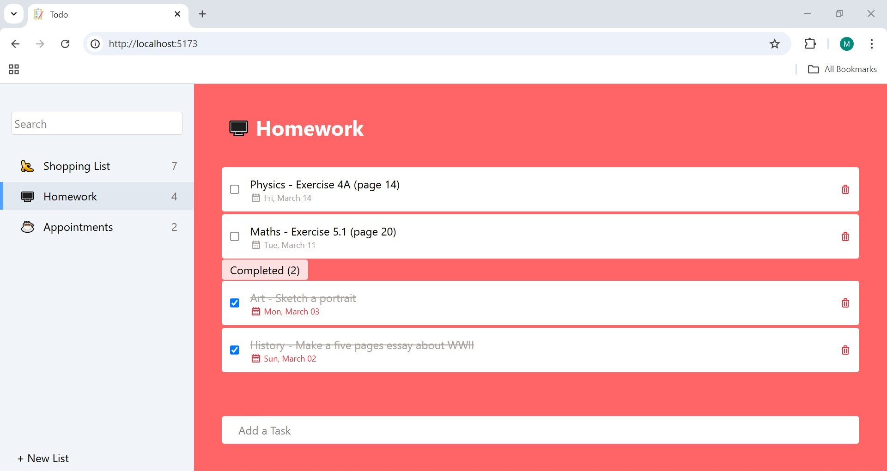
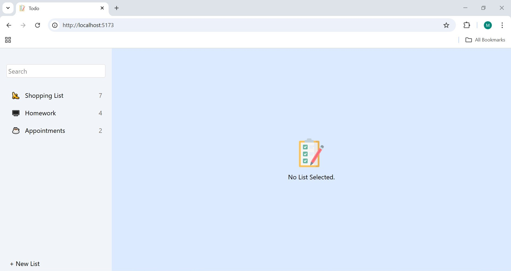
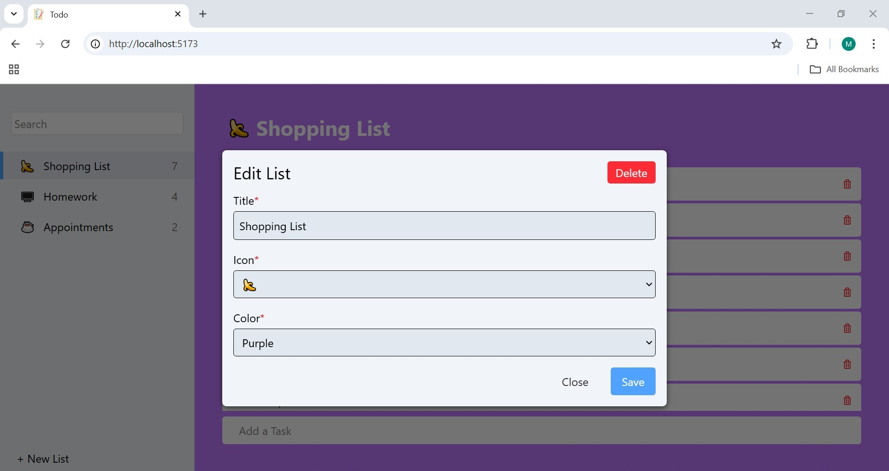

# Todo App



## 📌 Description

Todo is a web application for managing your daily task list. Designed with a simple and intuitive interface, it allows users to easily add, complete, and delete tasks.

## ✨ Features

- ➕ Add new lists
- 📝 Edit existing lists
- 🚩 Delete unnecassary lists
- 🔍 List search
- ✍️ Add new tasks
- ✅ Mark tasks as completed
- ❌ Delete unnecessary tasks

## 🛠️ Technologies Used

- **Frontend:** React.js, Tailwind CSS
- **Backend:** Node.js, Express.js
- **Data Storage:** JSON file

<!-- ## 🚀 Installation & Running the Application

### 1. Clone the Repository

```sh
git clone https://github.com/marsellius88/todo-1
cd todo-1
```

### 2. Install Dependencies

```sh
npm install
```

### 3. Configure Environment Variables

Create a `.env` file and add the following configuration:

```env
REACT_APP_API_URL=http://localhost:5000
```

### 4. Run the Application

```sh
npm start
```

Access the application at `http://localhost:3000` -->

## 📷 Application Preview

| Home                                         | Edit List                                         |
| ------------------------------------------------- | ------------------------------------------------- |
|  |  |

<!-- ## 🤝 Contribution
Contributions are welcome! If you want to contribute, follow these steps:
1. Fork this repository
2. Create a new branch (`git checkout -b new-feature`)
3. Commit your changes (`git commit -m 'Add new feature'`)
4. Push to the branch (`git push origin new-feature`)
5. Create a Pull Request

## 📄 License
This application is licensed under the **MIT** license. Please check the `LICENSE` file for more details. -->

---

💡 Created with ❤️ by [marsel](https://github.com/marsellius88)
